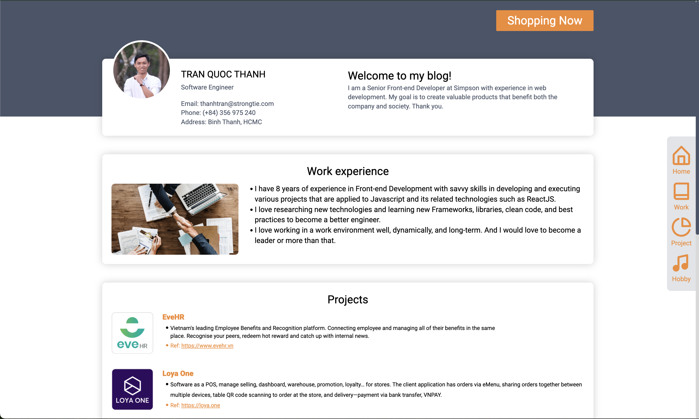
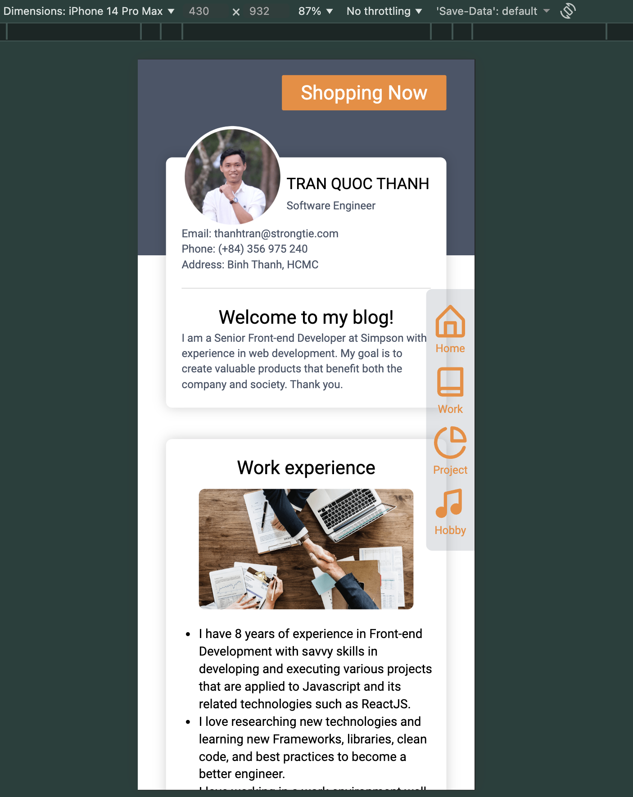
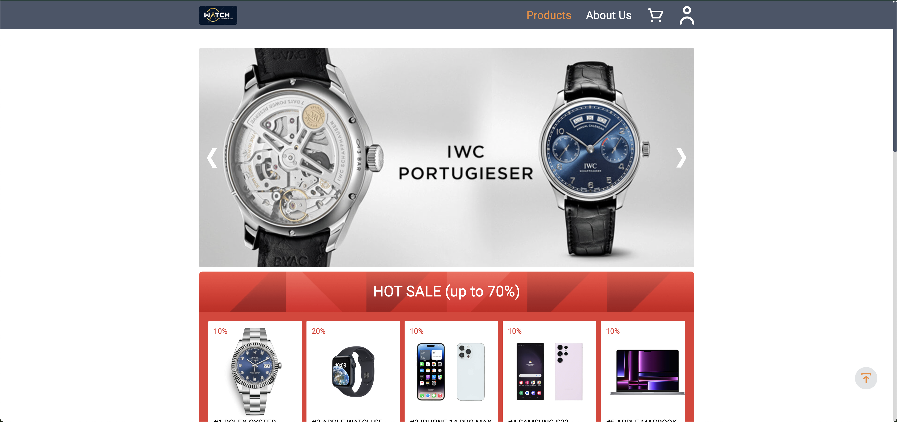
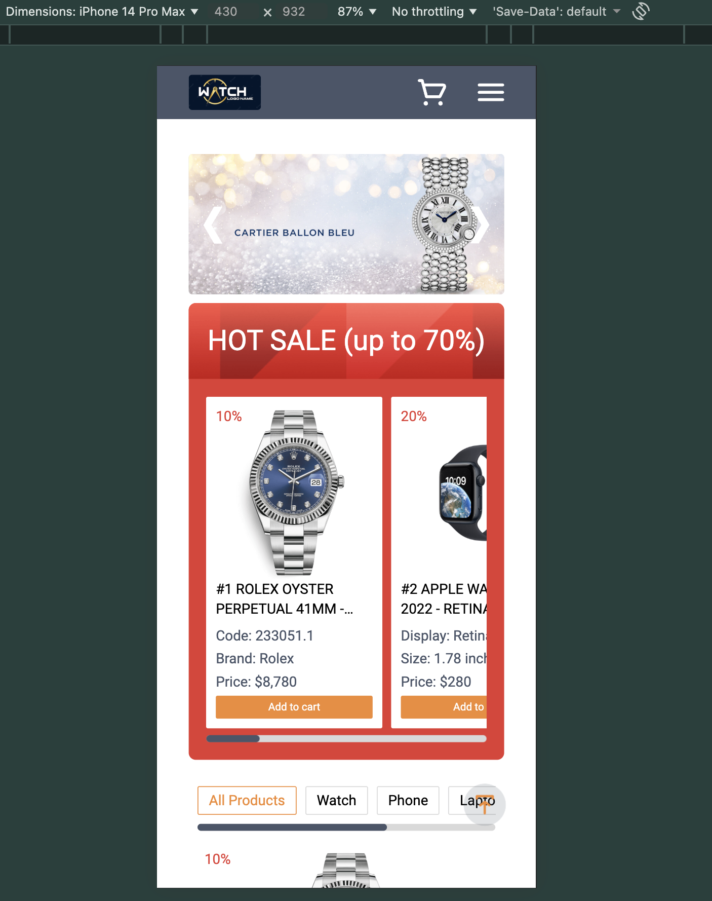

# Micro-Frontend Shopping Platform

A production-ready micro-frontend e-commerce platform built with React, Module Federation and a shared Web Component UI library.

This project demonstrates how to build scalable, independently deployable frontend applications with shared UI components, real-world routing, state management and performance handling for large datasets.

Live Demo  
Host (Container): https://simpson-thanh-pj1-host.vercel.app  
Shop (Remote App): https://simpson-thanh-pj1-shopping-center.vercel.app

---

## Screenshots

| Desktop                                | Mobile                                |
| -------------------------------------- | ------------------------------------- |
|  |  |
|     |     |

---

## Key Features

- Micro-frontend architecture using Webpack Module Federation
- Independently deployable applications (Host & Remote)
- Shared Web Component UI library published to npm
- Product catalog with 5,000+ records, pagination & infinite scroll
- Cart & checkout flow with persistent session state
- Mobile-first adaptive layout
- Production deployment on Vercel

---

## Architecture Overview

```
container/      → Host application (landing + shell)
shop/           → Remote shopping center (micro-frontend)
ui-libs/        → Shared Web Component UI library (published to npm)
vuejs-demo/     → Vue integration demo
angular-demo/   → Angular integration demo
```

## Tech Stack

- React 18
- Webpack Module Federation
- React Router v6
- Web Components (Custom Elements)
- Lerna Monorepo
- Tailwind CSS
- Vercel

---

## UI Library (npm)

Shared Web Component Input Library (my lib)  
https://www.npmjs.com/package/thanh-pj1-ui-lib

The component works seamlessly with:

- Vanilla JS
- React
- Angular
- Vue

---

## Local Development

```bash
yarn
yarn start
```

Host: http://localhost:3000
Shop: http://localhost:3001

## What This Project Demonstrates

- Large-scale frontend architecture
- Cross-framework component interoperability
- Performance handling for large datasets
- Independent deployment pipelines
- Real-world product workflows (catalog → cart → checkout)

## Figma Design

- https://www.figma.com/file/GMZUTl4NBoWYj3Gmrrq10s/Simpson-Thanh-Project1?type=design&node-id=0%3A1&mode=dev
